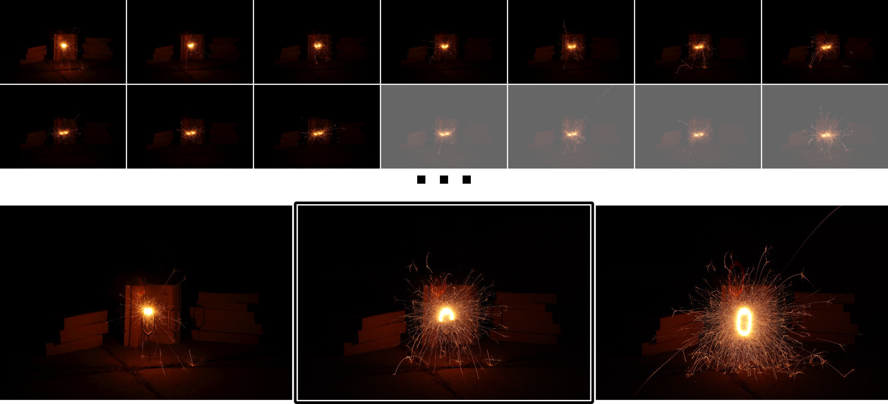
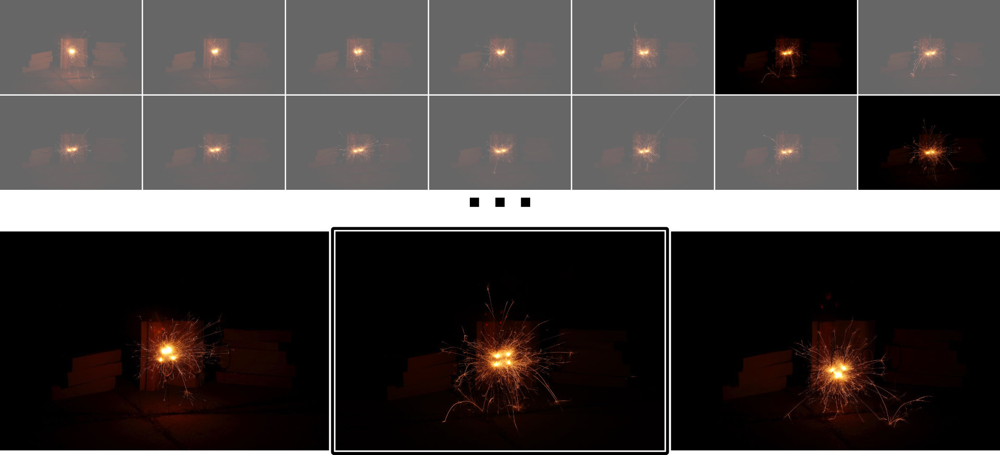
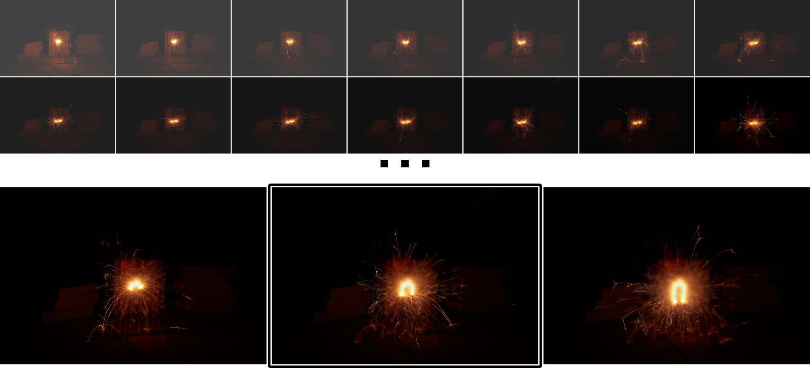

# VirtualDub (2) video filter plugins


## Frame Accumulation
Create long exposure images from short exposure videos or photo burst sequences (with a static camera).
Each frame is combined with the previous frame (accumulated) via `max/add/multiply` operation.
- `max` — brighter pixels in the new frame will replace darker pixels in the previous
- `add` — pixel values are added up, i.e. eventually fading all non-black regions to white
- `multiply` — pixel values are multiplied, i.e. over time only always bright regions remain

Example video filter setup:
```
Frame Accumulator (Max)
```




## Frame Delay
Access previous frames along with the current one in the video filter pipeline.
Allows e.g. to create interesting time manipulation effects (in combination with `blend layers`).  
Notice: The more frames you want to "go back in time", the more frames need to be buffered in memory, so this becomes expensive for higher delay values.

Example video filter setup:
```
Current_frame = null transform
Frame Delay (8 Frames)
blend layers (Lighten 100%)
    (Previous output)
    Current_frame
```




## Frame Cache
`Save` and `load` a single frame at arbitrary points in the video filter pipeline.
If used in reverse order (`load` ... `save`), the processing output of the last frame can be loaded to create processing loops, e.g. for fade-out animations (in combination with `blur` and `blend layers`).

Example video filter setup:
```
Current_frame = null transform
Frame Cache (Load)
blur
blend layers (Lighten 100%)
    (Previous output)
    Current_frame
Frame Cache (Save)
```




---

Based on [Windows-VirtualDub-Plugin-BlackWhite](https://github.com/shadwork/Windows-VirtualDub-Plugin-BlackWhite)
